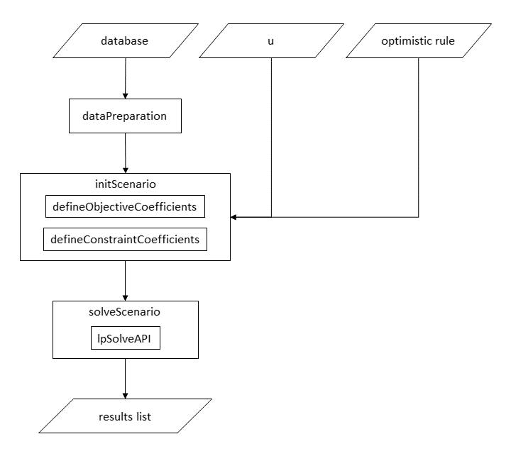

optimLanduse
-----------

<h3>
<a name="menu"></a>
</h3>
<ul>
<li>
<a href="#1. Einleitung">Introduction</a>
</li>
<li>
<a href="#3. Input und Output">Package structure</a>
</li>
<li>
<a href="#6. Beispielhafte Anwendung">Exemplary application</a>
</li>
<li>
<a href="#7. Literatur">Literature</a>
</li>
</ul>


<h3>
<a name="1. Einleitung">Introduction</a>
</h3>

**optimLanduse** provides methods for robust multi-criterial landscape optimization that explicitly include uncertainty in the optimization of the land allocation. High landscape diversity is assumed to increase the number and level of ecosystem services. However, the interactions between ecosystem service provision, disturbance and landscape composition are poorly understood. Knoke et al. (2016) therefore presented a novel approach to include uncertainty in the optimization of land allocation for improving the provision of multiple ecosystem services. The optimization framework of Knoke et al. (2016) is implemented in the **optimLanduse** package, with aim to make it easily accessable for practical the land-use optimzation and to enable batch applications of land-use optimizations.

The method is already established in land-use optimization an has been applied in a couple of studies. More details about the theory, the formal optimization problem definition and also significant examples are listed in the <a href="#7. Literatur">literature</a> section

We designed a graphical shiny application for the package to get a quick idea of the functionalities of the package, see https://gitlab.gwdg.de/forest_economics_goettingen/optimlanduse_shiny.


<h3>
<a name="3. Input und Output">Package structure</a>
</h3>
This chapter privides brief overview over the package functions. Please consider their respective help pages for more information. The function loSolveAPI comes from the **lpSolveAPI** package. https://cran.r-project.org/package=lpSolveAPI

#### Input
- Parameterdatei mit Erwartungen und Unsicherheiten. Formatiert wie in der Bespieldatei **dataset.xlsx**
- Unsicherheit **u**
- Form des optimistischen Szenarios, Erwartung oder Erwartung + Unsicherheit?

#### Output
- Landnutzungsanteile
- Szenarientabelle
- Mindestabstand **&beta;**


<p align="center">
  
</p>

<h3>
<a name="6. Beispielhafte Anwendung">Exemplary application</a>
</h3>
Um die aktuellste stabile Version zu installieren, führen Sie den folgenden Code aus. Kann dann weg.

``` r
## Benötigte Pakete
# Gestestet mit R Version 4.0.3. Bei älteren Versionen müssen die Pakete womöglich einzeln nacheinander installiert werden.
packages <- c("devtools", "lpSolveAPI",
             "dplyr", "tidyr", "remotes",
             "readxl")

## Herunterladen und installieren oder aktivieren

package.check <- lapply(
  packages,
  FUN = function(x) {
    if (!require(x, character.only = TRUE)) {
      install.packages(x, dependencies = TRUE)
      library(x, character.only = TRUE)
    }
  }
)

install_gitlab("forest_economics_goettingen/optimlanduse", host = "gitlab.gwdg.de")

```

Simple example
``` r
# Pakete laden
library(optimLanduse) 
library(readxl)
library(lpSolveAPI)  
library(dplyr)  
library(tidyr) 

# Daten einlesen
# Es ist zwingend eine "indicator" und eine "direction" Spalte noetig

dat <- read_xlsx(exampleData("databaseShrinked.xlsx"), col_names = FALSE)
dat <- dataPreparation(dat, uncertainty = "SE", expVAL = "mean")

# Optimierung initialisieren
init <- initScenario(dat, uValue = 2, optimisticRule = "expectation", fixDistance = NULL)

# Optimierung durchführen
result <- solveScenario(x = init)

# Resultate ansehen
result$landUse # Landnutzungsanteile
result$scenarioTable # Szenariotabelle
result$scenarioSettings # Einstellungen anzeigen
result$status # Erfolgreich optimiert oder abgebrochen?
result$beta # Beta
```

Exemplary bartch application for distict unverteinty values u
``` r
# Pakete laden
library(optimLanduse)
library(readxl)

# Daten einlesen
dat <- read_xlsx(exampleData("databaseShrinked.xlsx"), col_names = FALSE)
dat <- dataPreparation(dat, uncertainty = "SE", expVAL = "mean")

# Sequenz definieren
u <- seq(1, 5, 1)

# Batch vorbereiten
loopDf <- data.frame(u = u, matrix(NA, nrow = length(u), ncol = 1 + length(unique(dat$landUse))))
names(loopDf) <- c("u", "beta", unique(dat$landUse))

# Optimierungen initialisieren und durchführen
# Beispielhaft werden nur die Landnutzungsanteile gespeichert.

# Alternative 1: Schleife, einfach zu programmieren

loopDf <- data.frame(u = u, matrix(NA, nrow = length(u), ncol = 1 + length(unique(dat$landUse))))
names(loopDf) <- c("u", "beta", unique(dat$landUse))

for(i in u) {
  init <- initScenario(dat, uValue = i, optimisticRule = "expectation", fixDistance = NULL)
  result <- solveScenario(x = init)
  loopDf[loopDf$u == i,] <- c(i, result$beta, as.matrix(result$landUse))
}

# Alternative 2: apply, schneller
applyDf <- data.frame(u = u)

applyFun <- function(x) {
  init <- initScenario(dat, uValue = x, optimisticRule = "expectation", fixDistance = NULL)
  result <- solveScenario(x = init)
  return(c(result$beta, as.matrix(result$landUse)))
}

applyDf <- cbind(applyDf,
                 t(apply(applyDf, 1, applyFun)))
```

Show the land-use allocations with increasing unvertainty
``` r
# Show the result visually
require(ggplot2)
applyDf %>% gather(key = "land-use option", value = "land-use share", -u, -beta) %>%
  ggplot(aes(y = `land-use share`, x = u, fill = `land-use option`)) +
  geom_area(alpha = .8, color = "white") + theme_minimal()
```


Batch example - parallel

``` r
# Pakete laden
library(optimLanduse) 
library(readxl)
library(doParallel)

# Daten einlesen
dat <- read_xlsx(exampleData("databaseShrinked.xlsx"), col_names = FALSE)
dat <- dataPreparation(dat, uncertainty = "SE", expVAL = "mean")

# Kerne initialisieren, bspw. 8 Kerne
registerDoParallel(8)

# Sequenz definieren
u <- seq(1, 5, 1)

# Batch initialisieren und durchführen
loopDf1 <- foreach(i = u, .combine = rbind, .packages = "optimLanduse") %dopar% {
  init <- initScenario(dat, uValue = i, optimisticRule = "expectation", fixDistance = NULL)
  result <- solveScenario(x = init)
  c(i, result$beta, as.matrix(result$landUse))
}
# Falls die Kerne wieder freigegeben werden sollen
stopImplicitCluster()
```

Batch application for distict uncertainty values and fixed distance at the highest unceretainty level.

``` r
# Pakete laden
require(optimLanduse)
require(dplyr)  
require(readxl)
require(lpSolveAPI)  

# Daten einlesen
dat <- read_xlsx(exampleData("databaseShrinked.xlsx"), col_names = FALSE)
dat <- dataPreparation(dat, uncertainty = "SE", expVAL = "mean")

# Sequenz definieren
u <- c(5:1) # Wichtig: rueckwaerts!

# Batch vorbereiten
applyDf <- data.frame(u = u)
dist <- NULL
applyFun <- function(x) {
  init <- initScenario(dat, uValue = x, optimisticRule = "expectation",
                       fixDistance = dist)
  result <- optimLanduse::solveScenario(x = init)
  dist <<- result$distance
  return(c(result$beta,
           as.matrix(result$landUse)))
}

# Run & Ergebnis
applyDf <- cbind(applyDf,
                 t(apply(applyDf, 1, applyFun))) %>% 
                 rename_at(vars(factor(1:(length(unique(dat$landUse))+1))),
                           ~ c("beta",unique(dat$landUse))) 
```

<h3>
<a name="7. Literatur">Literature</a>
</h3>

Gosling, E., Reith, E., Knoke T., Gerique, A., Paul, C. (2020): Exploring farmer perceptions of agroforestry via multi-objective optimisation: a test application in Eastern Panama. <em>Agroforestry Systems</em> **94**. https://doi.org/10.1007/s10457-020-00519-0

Knoke, T., Paul, C., Hildebrandt, P. et al. (2016): Compositional diversity of rehabilitated tropical lands supports multiple ecosystem services and buffers uncertainties. <em>Nat Commun</EM> **7**, 11877. https://doi.org/10.1038/ncomms11877

Paul, C., Weber, M., Knoke, T. (2017): Agroforestry versus farm mosaic systems – Comparing land-use efficiency, economic returns and risks under climate change effects. <em>Sci. Total Environ.</em> **587-588**. https://doi.org/10.1016/j.scitotenv.2017.02.037.

Knoke, T., Paul, C., et al. (2020). Accounting for multiple ecosystem services in a simulation of land‐use decisions: Does it reduce tropical deforestation?. <em>Global change biology</em> **26(4)**. https://doi.org/10.1111/gcb.15003

Gosling, E., Reith, E., Knoke, T., Gerique, A., & Paul, C. (2020). Exploring farmer perceptions of agroforestry via multi-objective optimisation: a test application in Eastern Panama. <em>Agroforestry Systems</em>, **94(5)**. https://doi.org/10.1007/s10457-020-00519-0
